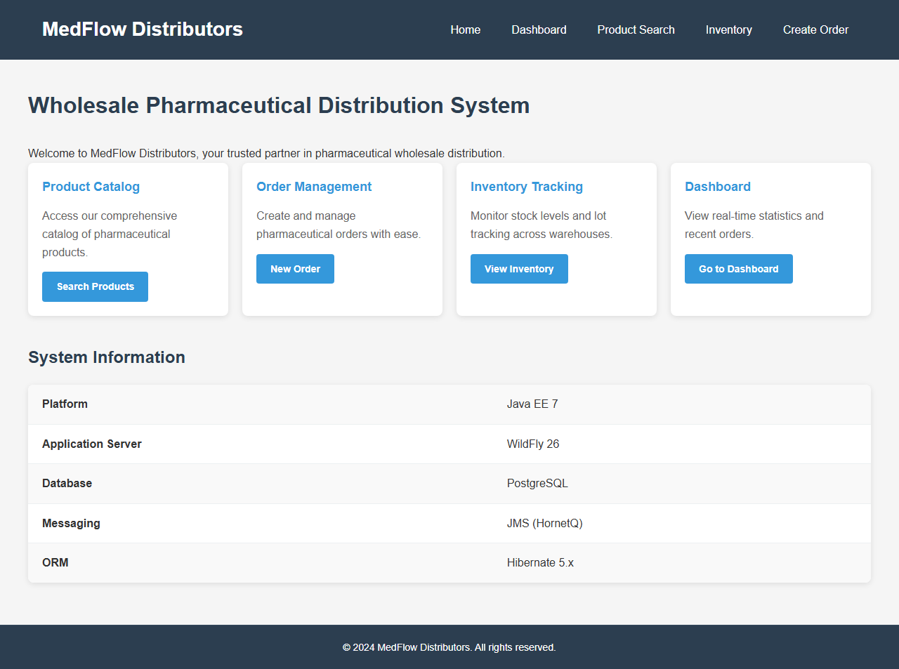
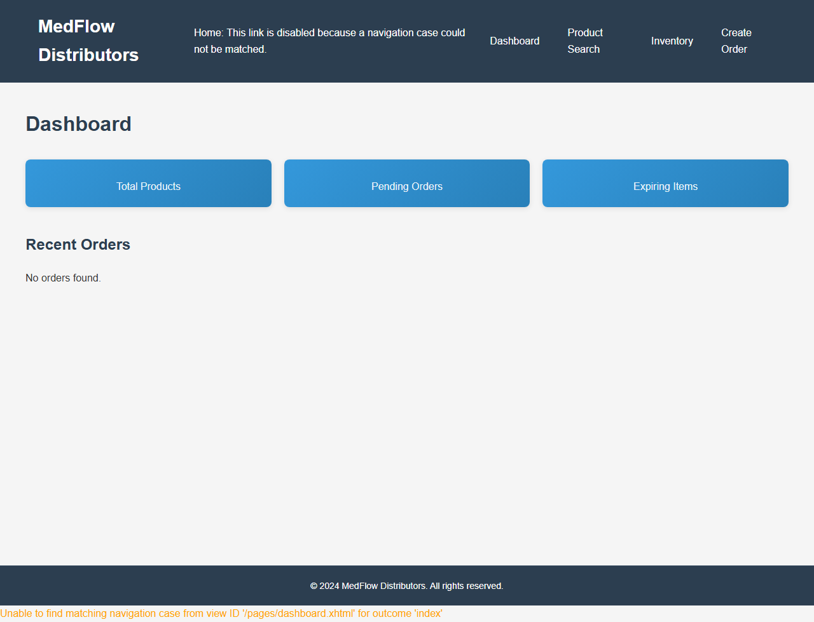
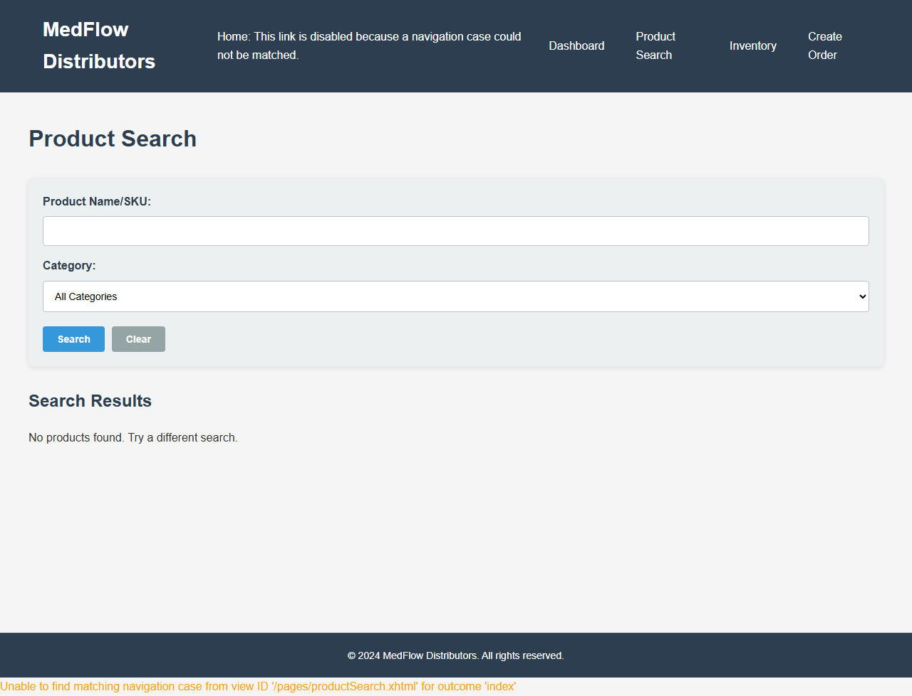
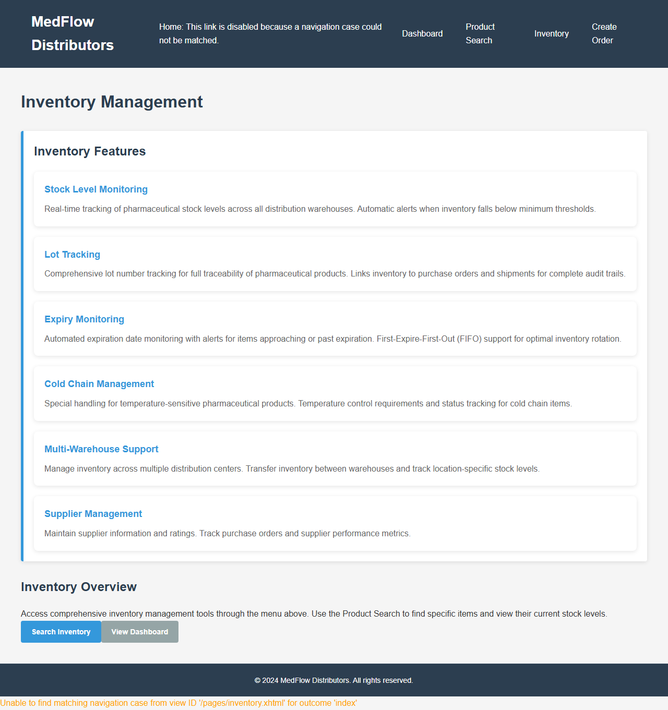
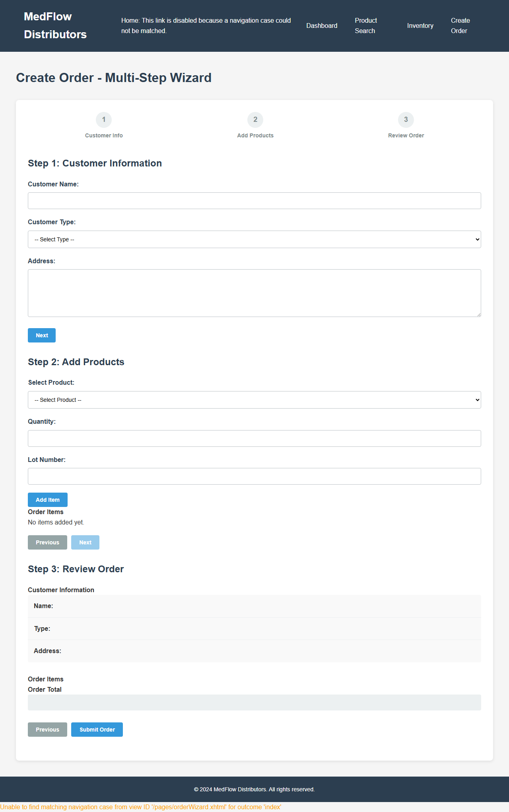

## Overview

This lab migrates a legacy Java EE 7 application running on WildFly to Spring Boot with cloud-native patterns. The target application is MedFlow Distributors, a pharmaceutical distribution management system.

## Understanding the Legacy Application

The following sections show the legacy Java EE 7 application running on WildFly 26 with PostgreSQL, prior to migration to Spring Boot.

### Application Server

The WildFly 26.1.3 application server welcome page confirms the server is running and ready to serve the MedFlow Distributors application:

### Homepage & Navigation

The main landing page features navigation to all major sections (Dashboard, Product Search, Inventory, Create Order), four feature cards highlighting core capabilities, and a system information table showing the legacy stack: Java EE 7, WildFly 26, PostgreSQL, JMS (HornetQ), and Hibernate 5.x.

### Dashboard

The Dashboard page displays three statistics cards (Total Products, Pending Orders, Expiring Items) and a Recent Orders table. The database is empty in this initial state, showing "No orders found."

### Core Business Features

The Product Search page provides a search form with Product Name/SKU text input and Category dropdown filter. Results area shows "No products found" in the empty database state:

The Inventory Management page showcases six feature sections: Stock Level Monitoring, Lot Tracking, Expiry Monitoring, Cold Chain Management, Multi-Warehouse Support, and Supplier Management:

The order creation wizard demonstrates complex JSF form handling with three phases — Customer Information, Add Products, and Review Order. This will be migrated to Thymeleaf + htmx:

### REST API Endpoints

The JAX-RS REST API endpoints (`/api/products` and `/api/orders`) return JSON responses. These will be migrated from JAX-RS to Spring MVC `@RestController` annotations:

## Screenshots Reference

| Screenshot | Description |
|---|---|
|  | WildFly application server |
|  | MedFlow Distributors homepage |
|  | Dashboard with statistics |
|  | Product search page |
|  | Inventory management |
|  | Multi-step order wizard |
|  | Products REST API |
|  | Orders REST API |
